# How to Host CTF Web Challenges


These are things we've learned about hosting CTF web challenges using Google Cloud Run on Google Cloud Platform (GCP).

## Requirements/Limitations
- The challenge must be a web application.
- This technique does not support arbitrary protocols/ports.
- Your web application can listen on any port internally but it will be exposed to the Internet on port 443 via `https://`.
- The challenge must be containerized as a Docker image.
- You must have a google cloud account.
- You must install the gcloud command line tooling.
- It is easiest if your web application requires no server-side session/state.
  - With some effort, you can set up a Cloud Run service to talk to a Google-hosted REDIS instance but it is well worth some effort to see if you can avoid the need for this.
  - For example, you might be able to keep the entire session state in a Cookie using something like JWT.
- These steps were done on a Mac.  YMMV

## What Should I Do First?

- If your CTF event planning is far enough along, you should seek [sponsorship from GCP](https://services.google.com/fb/forms/ctfsponsorship/).
  - If you get sponsored, you'll get some free google cloud money to help host your event.
- Learn Docker.  There are lots of great resources online.  Install Docker locally and run through some online tutorials.
  - Here is at least one way [to get started](https://www.youtube.com/watch?v=3c-iBn73dDE).
- Sign up for [Google Cloud Platform (GCP)](https://console.cloud.google.com/). When I first did this with my personal Google account, it gave me $300 free cloud bucks and a few months to spend them.
  - This is a wonderful way to play around with the bits of GCP that are interesting to you.
  - Note: There are likely too many facets to try to learn everything in a few months.
  - You'll encounter a few of them in these instructions and the rest will just be purposefully ignored.
- [Setup a Google Cloud "Project"](https://cloud.google.com/resource-manager/docs/creating-managing-projects).
  - Inside such a "project" is where you will do everything related to your CTF challenge hosting.
  - You can create multiple projects if you like, but the things you do inside one will not affect or be seen by the other. 
- [Install the gcloud CLI (command line interface)](https://cloud.google.com/sdk/docs/install) onto your computer.
  - As we progress in the instructions, you'll see that you can often set up something in GCP just by using the Web UI.  However, it is well worth getting used to the gcloud CLI since it allows for easier automation such as with bash scripts. 
  - At some point you'll run `gloud init`.  This is where you will:
    - authenticate gcloud so that it has permissions to "talk to" your GCP project
    - select which "project" you want gcloud to talk to by default (it is easy to switch between projects and even between multiple google accounts if needed)

For this tutorial, I created this project:

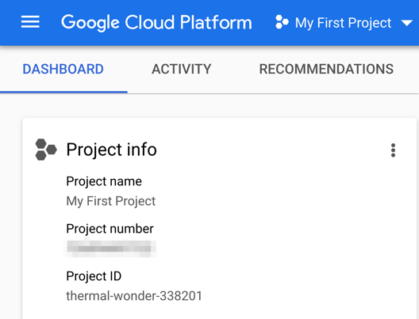

## My First Web Challenge

Here, we'll create a trivial web challenge and deploy it to Google Cloud Run.

### Challenge Application Source Files

See the `my-first-web-challenge` folder in this repository for the files cited here.

You'll want [nodejs installed](https://nodejs.org/en/download/) if you want to follow along with all the steps here.

Here are the files that make up the source of the challenge app.

[package.json]
```
{
  "name": "my-first-web-challenge",
  "version": "1.0.0",
  "description": "",
  "main": "index.js",
  "scripts": {
    "test": "echo \"Error: no test specified\" && exit 1"
  },
  "author": "",
  "license": "ISC",
  "dependencies": {
    "express": "^4.17.3"
  }
}
```

[package-lock.json]
This file is created automatically when you first run `npm install` (see below).  You generally want this file to be under source control.


[index.js]
```
let express = require('express');
let app = express();

app.get('/', function(req, res) {
    res.sendFile(__dirname + '/index.html')
});

let port = 8000;
let server = app.listen(port);
console.log('Local server running on port: ' + port);
```

[index.html]
```
<html>
<body>
<p>This is my first html page.  Not much to see here.</p>
<!-- flag{wh4t_m4d3_y0u_l00k_h3r3?} -->
</body>
</html>
```

We won't be teaching you how to use node or the express library but there are 
lots of great resources online.

### Run the Challenge Locally (without Docker)

First bring up a terminal window and cd into the `my-first-web-challenge` folder.

Run this command:

`npm install`

`npm` is part of nodejs.  This will study package.json and download the express library and its dependencies into a folder named `node_modules` (which will be created).

You might see output like this:

```
added 50 packages, and audited 51 packages in 546ms

2 packages are looking for funding
  run `npm fund` for details

found 0 vulnerabilities
```

And now you'll notice a `node_modules` folder has been created.

**Note**: You should always add `node_modules` to a .gitignore file in your git repository.  This will prevent the contents of this folder from being added to source control.

We can now run the application:

`node index.js`

You should see:
`Local server running on port: 8000`

**Note**: This assumes this port is free on your computer.  Feel free to edit `index.js` to use another port.

Now if you open your web browser to this link:

[http://localhost:8000/](http://localhost:8000/)

and you should see something like:

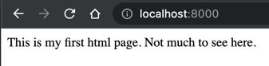

Of course, if you right-click inside the page and select View Page Source you'll see the flag:

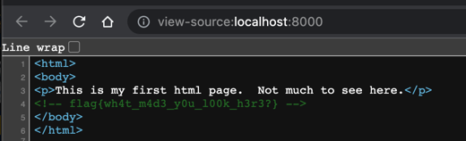

You can press `Control+C` in the terminal window to stop the application.

### Run the Challenge Using Docker

In order to containerize our challenge application, we'll need a `Dockerfile`.

[Dockerfile]
```
FROM node:12

RUN mkdir -p /ctf/app
WORKDIR /ctf/app

COPY ./package.json ./
COPY ./package-lock.json ./
RUN npm install

COPY ./index.js ./
COPY ./index.html ./
EXPOSE 8000

CMD ["node", "index.js"]
```

[.dockerignore] (not really needed in this project but might be useful in a more complex project)
```
# files to not include in the image
Dockerfile
docker-compose.yml
node_modules
```

It is not our intention to teach you Docker but a couple items here are worth pointing out.

Note that the `EXPOSE 8000` line is purely decorative.  Docker completely ignores it.  It is mainly there to help the reader know that the application will be listening on a certain port.

Also, notice this copies the `package.json` and `package-lock.json` files and then runs `npm install`.

Then afterward, it copies `index.js` and `index.html`.

Why not just copy **everything** up front and then run `npm install`?

Because Docker keeps track of the state of your image after every line of the Dockerfile.

If you are rebuilding an image and Docker can convince itself that all the inputs up to a certain line have not changed, then it'll skip those steps and just use its cached status.

So, if you copied everything up front, then any edit you make to `index.js` or `index.html` will cause `npm install` to re-run when you build the image.

In contrast, in the above `Dockerfile`, edits to these files will not cause `npm install` to run because none of the files cited before that line will have changed.


We can now build our docker image:

```docker build -t my-first-web-challenge:1.0 .```

This tells docker to build an image with the name `my-first-web-challenge` and the tag `1.0`.
The `.` at the end tells it to study the `Dockerfile` in the current directory.

You might get output like this:

```
[+] Building 48.3s (13/13) FINISHED
 => [internal] load build definition from Dockerfile                                                                                                                                                                         0.0s
 => => transferring dockerfile: 243B                                                                                                                                                                                         0.0s
 => [internal] load .dockerignore                                                                                                                                                                                            0.0s
 => => transferring context: 119B                                                                                                                                                                                            0.0s
 => [internal] load metadata for docker.io/library/node:12                                                                                                                                                                   1.5s
 => [1/8] FROM docker.io/library/node:12@sha256:461c7f8b5e042fa7f47620cbee7772e76ce3fa0891edaab29bf7ebf0e84b9a1a                                                                                                            42.4s
 => => resolve docker.io/library/node:12@sha256:461c7f8b5e042fa7f47620cbee7772e76ce3fa0891edaab29bf7ebf0e84b9a1a                                                                                                             0.0s
 => => sha256:543479162c86f09f3dd624d4b79bc52861431a62fd96eb2ee0727c395cc0d99e 7.69kB / 7.69kB                                                                                                                               0.0s
 => => sha256:0030cc4ce25ce472fe488839def15ec8f2227bb916461b518cf534073c019a86 45.43MB / 45.43MB                                                                                                                             8.4s
 => => sha256:461c7f8b5e042fa7f47620cbee7772e76ce3fa0891edaab29bf7ebf0e84b9a1a 776B / 776B                                                                                                                                   0.0s
 => => sha256:7aeb3a7feab20a6e4e38c3d4745977ce2cd4dec48c84612b1617f0813065f617 2.21kB / 2.21kB                                                                                                                               0.0s
 => => sha256:7ab54d469df647484a8ae344911382d9b4412045d3c0f6536e7442858952cc68 11.30MB / 11.30MB                                                                                                                             2.2s
 => => sha256:0c84a1692804545a237be30579f35e501652cab9a2d8babe2693e66e653c706f 4.34MB / 4.34MB                                                                                                                               1.5s
 => => sha256:628acdaf85032c817e9eb7f4749b887f3733c8c590d2e3c2f396f2051406557f 49.77MB / 49.77MB                                                                                                                            13.1s
 => => sha256:cd55abb6ddd3a9acde3855d39958c460e6fa36b3008d6a6206408c133ab96427 214.47MB / 214.47MB                                                                                                                          31.0s
 => => sha256:561384047eedda5a3ac1d331766ef6303c5154f1a759b63e27ac93e0c12721c9 4.19kB / 4.19kB                                                                                                                               8.5s
 => => extracting sha256:0030cc4ce25ce472fe488839def15ec8f2227bb916461b518cf534073c019a86                                                                                                                                    2.1s
 => => sha256:0108341960c8b322c6e8fbad210fc42ef2e725b01b6d249fb171b054f3a3dfe2 23.70MB / 23.70MB                                                                                                                            13.1s
 => => extracting sha256:7ab54d469df647484a8ae344911382d9b4412045d3c0f6536e7442858952cc68                                                                                                                                    0.4s
 => => extracting sha256:0c84a1692804545a237be30579f35e501652cab9a2d8babe2693e66e653c706f                                                                                                                                    0.2s
 => => sha256:c230c13456fd6acc4074095364629904055974f15859a636e4b02d673dcaf903 2.34MB / 2.34MB                                                                                                                              13.7s
 => => sha256:6a4a51acaaf962d42394bbf97f28e5a8d30e001b2642d8151cabe925e3e10b5c 463B / 463B                                                                                                                                  13.4s
 => => extracting sha256:628acdaf85032c817e9eb7f4749b887f3733c8c590d2e3c2f396f2051406557f                                                                                                                                    2.4s
 => => extracting sha256:cd55abb6ddd3a9acde3855d39958c460e6fa36b3008d6a6206408c133ab96427                                                                                                                                    8.6s
 => => extracting sha256:561384047eedda5a3ac1d331766ef6303c5154f1a759b63e27ac93e0c12721c9                                                                                                                                    0.1s
 => => extracting sha256:0108341960c8b322c6e8fbad210fc42ef2e725b01b6d249fb171b054f3a3dfe2                                                                                                                                    1.5s
 => => extracting sha256:c230c13456fd6acc4074095364629904055974f15859a636e4b02d673dcaf903                                                                                                                                    0.1s
 => => extracting sha256:6a4a51acaaf962d42394bbf97f28e5a8d30e001b2642d8151cabe925e3e10b5c                                                                                                                                    0.0s
 => [internal] load build context                                                                                                                                                                                            0.0s
 => => transferring context: 32.80kB                                                                                                                                                                                         0.0s
 => [2/8] RUN mkdir -p /ctf/app                                                                                                                                                                                              0.9s
 => [3/8] WORKDIR /ctf/app                                                                                                                                                                                                   0.0s
 => [4/8] COPY ./package.json ./                                                                                                                                                                                             0.0s
 => [5/8] COPY ./package-lock.json ./                                                                                                                                                                                        0.0s
 => [6/8] RUN npm install                                                                                                                                                                                                    3.1s
 => [7/8] COPY ./index.js ./                                                                                                                                                                                                 0.0s
 => [8/8] COPY ./index.html ./                                                                                                                                                                                               0.0s
 => exporting to image                                                                                                                                                                                                       0.1s
 => => exporting layers                                                                                                                                                                                                      0.1s
 => => writing image sha256:4cc2c043a3814c31034c75f215ec5184e1df86bc91462dacc71d32d008b9470e                                                                                                                                 0.0s
 => => naming to docker.io/library/my-first-web-challenge:1.0                                                                                                                                                                0.0s

Use 'docker scan' to run Snyk tests against images to find vulnerabilities and learn how to fix them
```

We can now ask docker to list all the images and this one should now be included in the list output.

`docker images`

Possible output:

```
REPOSITORY               TAG       IMAGE ID       CREATED         SIZE
my-first-web-challenge   1.0       4cc2c043a381   3 minutes ago   920MB
```

Now that we have created an image, we can run it.  This will create a container from the image.

`docker run --rm -p 7000:8000 --name fun-app my-first-web-challenge:1.0`

- `--rm` tells Docker to remove the container that was created after it stops
  - this is not really needed but helps reduce clutter by reducing the count of Docker containers lying around
- `-p 7000:8000` causes Docker to listen for traffic on port 7000 and map it to port 8000 inside the container
  - this mainly drives home the point that you have to specify both an external and internal port or else no traffic will reach your application
- `--name fun-app` names the newly-created container `fun-app`
  - if you don't specify a name, docker will make up one for you
- `my-first-web-challenge:1.0` the image name and tag 

Again you should see output like:

```
Local server running on port: 8000
```

You can now access the application using this link:

[http://localhost:7000/](http://localhost:7000/)

and it should show just as before.

In another terminal window run:

`docker ps`

You should see output like this:

```
CONTAINER ID   IMAGE                        COMMAND                  CREATED         STATUS         PORTS                    NAMES
c879bb129966   my-first-web-challenge:1.0   "docker-entrypoint.s…"   7 minutes ago   Up 7 minutes   0.0.0.0:7000->8000/tcp   fun-app
```

To stop the application, you can use the Docker Dashboard UI or run this command:

`docker stop fun-app`

**Note**: You might be able to stop the application by pressing `Control+C` in the terminal window you used to start it. However, I'm not certain this is guaranteed to always work.


## Deploy the Image to Google Container Registry

We now want to upload our Docker image into Google Container Registry.

### Container Registry Web UI

The menu on the left of the GCP web UI has lots of items.  Just keep scrolling down until you find it here:

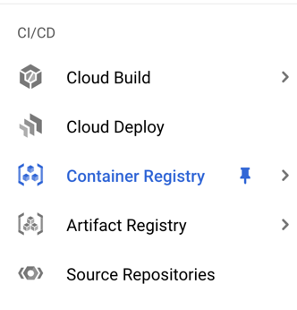

We recommend pinning that item so it'll appear for you at the top of the menu.

When you click it, you'll see a page like this with no items in the table yet.


### Allow docker to "push" to Container Registry

In order to get our web docker image into Google Container Registry we need to setup docker to be allowed to "push" to it.

[These instructions](https://cloud.google.com/container-registry/docs/advanced-authentication#gcloud-helper) will help you.

First run this: `gcloud auth login`

This will open the browser and allow you to select the google account you want to use.  It'll then ask you to confirm the permissions that gcloud needs.

Next run this: `gcloud auth configure-docker`

This will setup docker to be able to push to your project's container registry.  You might see output like:

```
{
  "credHelpers": {
    "gcr.io": "gcloud",
    "us.gcr.io": "gcloud",
    "eu.gcr.io": "gcloud",
    "asia.gcr.io": "gcloud",
    "staging-k8s.gcr.io": "gcloud",
    "marketplace.gcr.io": "gcloud"
  }
}
Adding credentials for all GCR repositories.
```

You'll notice the above content in your `~/.docker/config.json` file.


### Tag and Push the Image

Run this command to "tag" the image as being associated with your GCP project.

`docker tag my-first-web-challenge:1.0 gcr.io/thermal-wonder-338201/my-first-web-challenge:1.0`

The syntax here is:

docker tag <local-image-name>:<local-image-tag> gcr.io/<your-gcp-project-identifier>/<local-image-name>:<local-image-tag>

This should run immediately and produce no output.

To verify it actually did something run: `docker images`

You'll see something like:

```
REPOSITORY                                            TAG       IMAGE ID       CREATED        SIZE
my-first-web-challenge                                1.0       4cc2c043a381   22 hours ago   920MB
gcr.io/thermal-wonder-338201/my-first-web-challenge   1.0       4cc2c043a381   22 hours ago   920MB
```

Now we can ask docker to "push" this image to Google Container Registry:

`docker push gcr.io/thermal-wonder-338201/my-first-web-challenge:1.0`

You might see output like this:

````
The push refers to repository [gcr.io/thermal-wonder-338201/my-first-web-challenge]
0e4e990a5801: Pushed
e46d8f847897: Pushed
6028c55a5a49: Pushed
c794aac0a94c: Pushed
87dc0d8d7ee7: Pushed
5f70bf18a086: Layer already exists
50ed79383d91: Pushed
cba7f369883f: Layer already exists
46b21d2f25ec: Layer already exists
0fb7df40bb5b: Layer already exists
c26a5692b560: Layer already exists
0cd41aa80b1f: Layer already exists
7a6d0f54488f: Layer already exists
6ef8823b489f: Layer already exists
9578c16f3f7c: Layer already exists
3141322c5cdb: Layer already exists
1.0: digest: sha256:0ce5d03ccd5309e28c212348a74e3bc7f438881a16baeedf5398b0c0a0902570 size: 3668
````

### Viewing the Image in Container Registry

If you refresh your Container Registry web page, you should now see your pushed iage:

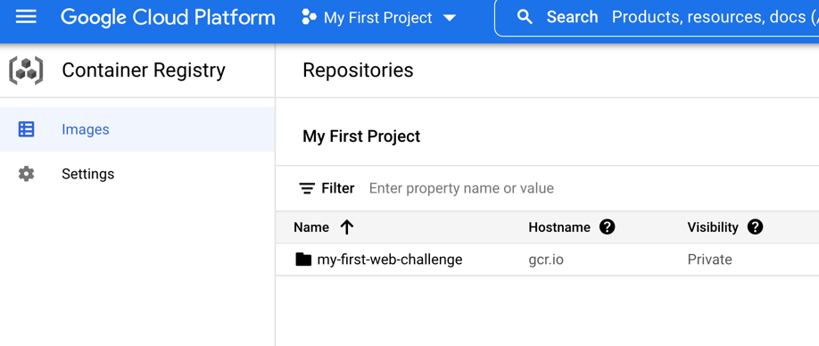

If you click on the image name, you are brought to a detail page like this:

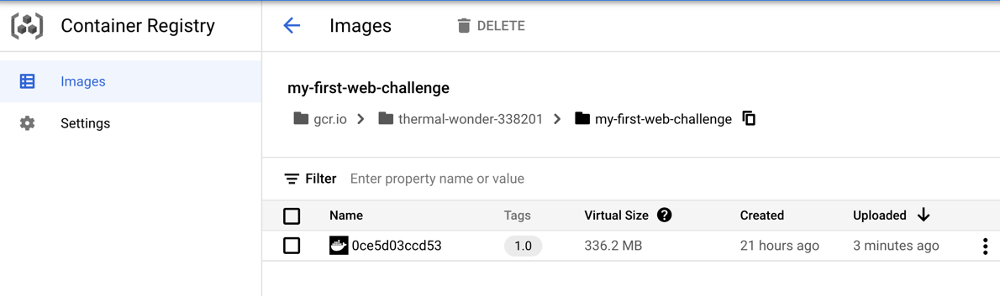

**Note**: You can build newer images with updated tags like `1.1` or `2.0` and run through the above steps with them as well.  They'll appear as new rows inside the details page for that image.

## Creating your first Google Cloud Run Service

Now that we have an image uploaded to Container Registry, we can create our first real web application inside Cloud Run.

First we'll do it via the web ui and later learn how to do it using the gcloud CLI.

Find the Cloud Run menu item in the large menu on the left.  Again, we suggest pinning it so it stays at the top.

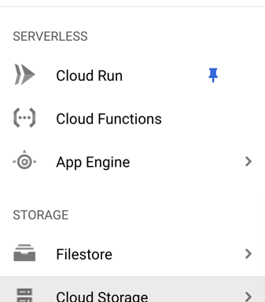

Open the Cloud Run web ui and you'll see you have no Services defined yet:

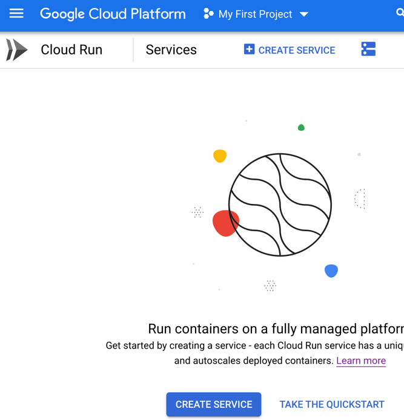

Start defining a service by clicking the **CREATE SERVICE** link.

The first item we specify is the image/revision we want to use.  Click the SELECT link here:

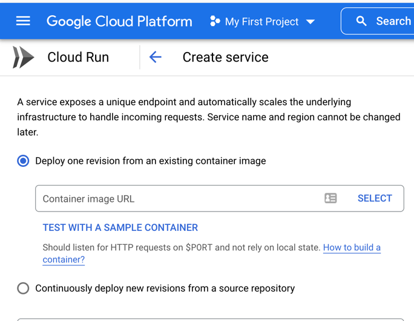

A list of your items from the Container Registry will appear on the right. Select the one you want:

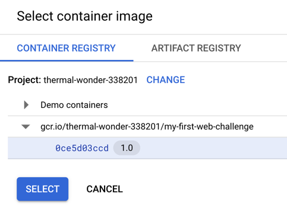

For the next several choices, we'll accept the defaults.

However, we have to decide whether to allow unauthenticated access.  For a CTF, that is exactly what we want:

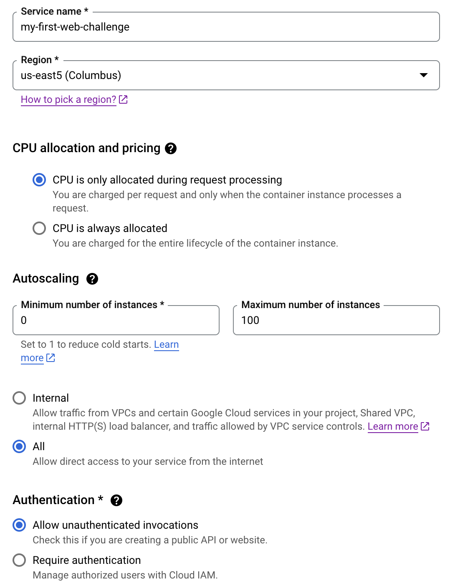

Some minor notes on these items:

- CPU allocation and pricing:
  - We left this at the default "CPU is only allocated during request processing".
  - In our experience, this worked fine and it is cheaper as well.
- Autoscaling:
  - min = 0, max = 100
  - When nobody is accessing your challenge Google will spin down all your instances to save money/resources.
  - If your challenge starts getting traffic, it will spin some back up.
  - If it gets a LOT of traffic, it will spin up even more instances.  It has a default heuristic that is fine but you can teak it as you'll see later.
  - If you have a web challenge where the timing of the request/response is important, you might consider setting min and max to the same value.
  - We had a couple challenges like this and set min = max = 10.  This ensures no users will see the delay caused by Cloud Run spinning up a new instance.
- Ingress:
  - Allow all traffic
  - not sure when you'd use the other choices here
- Authentication
  - Allow unauthenticated invocations
  - That's exactly what we want for a CTF challenge.


At the bottom is a **Containers, Variables & Secrets, Connections, Security** section.  Expand this.

The default connection port is `8080` and you'll want to change it to be `8000` for this example.

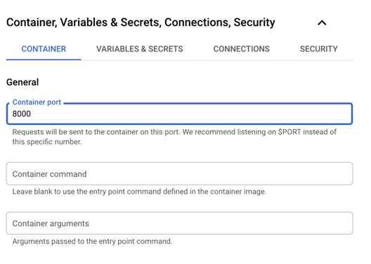

You can leave the next couple fields blank.

Next you enter the **Capacity** details:

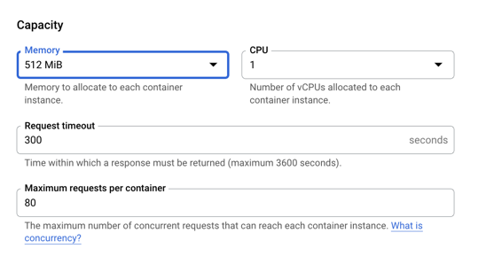

For most CTF web challenges I can think of you can likely go with the defaults.
I did increase the memory and CPUs in a challenge that used Puppeteer to invoke a headless version of Chrome.

We suggest you test out your challenge under some reasonable load to ensure you won't be surprised when your CTF opens.  Such testing is outside the scope of this document.

Here is where you can tweak the **Max requests per container**.

If more than this many simulaneous requests come in, then Cloud Run will spin up new instances as needed to keep the load per instance less than this.

Again, I've only reduced this in the case where the challenge invoked a headless Chrome.

Finally, select your desired **Execution environment**

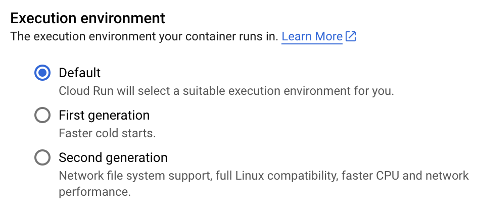

I think most web challenges will do fine with the "First generation".

I suggest only switching to the "Second generation" if you notice some issue.


## Hold Up!

Before you click **CREATE** to create your first Cloud Run Service, take a moment and notice the **SHOW COMMAND LINE** link at the upper right of the web page.

Go ahead and click that and you'll see:

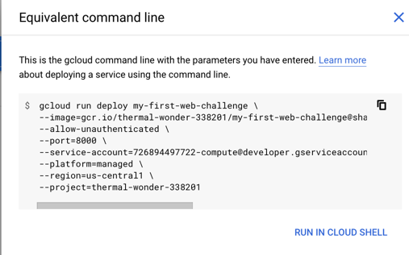

Save that command line away for later reference:

```
gcloud run deploy my-first-web-challenge \
--image=gcr.io/thermal-wonder-338201/my-first-web-challenge@sha256:0ce5d03ccd5309e28c212348a74e3bc7f438881a16baeedf5398b0c0a0902570 \
--allow-unauthenticated \
--port=8000 \
--service-account=726894497722-compute@developer.gserviceaccount.com \
--platform=managed \
--region=us-central1 \
--project=thermal-wonder-338201
```

Notice that since we mostly took the defaults, there are not that many options.  If we had varied from the defaults, this command line would then specify more things.

## Back to the show

Ok, now dismiss the pane on the right and click the **CREATE** button.

This will display some in-progress status as it does the work:

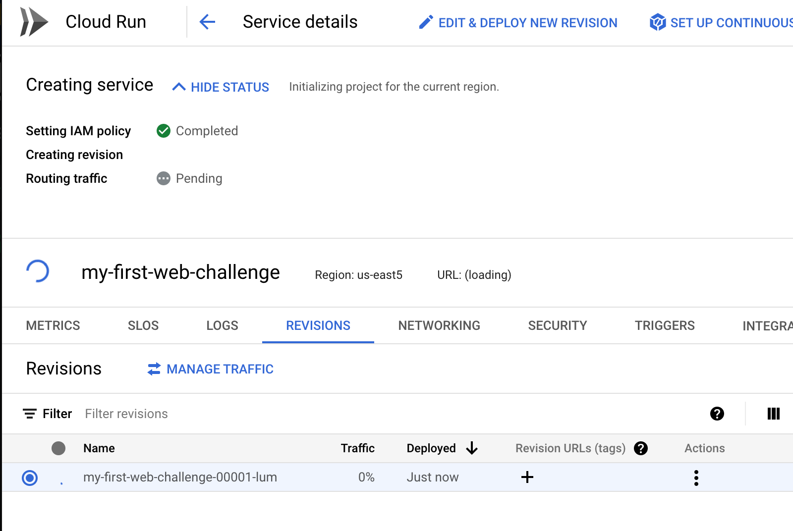

Internally, it will create an instance of your challenge and verify that it is actually listening on the port (8000) that you specified.

If there is any issue, you'll see an explanatory error,

After it finishes, you'll see something like this:

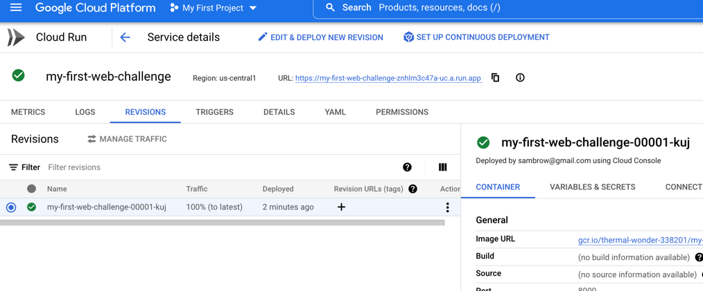


Notice at the top there is a **URL** for your app like: 

[https://my-first-web-challenge-znhlm3c47a-uc.a.run.app/](https://my-first-web-challenge-znhlm3c47a-uc.a.run.app/)

You can see this link uses `https://`.  There is no support for `http://`.

Also notice the domain name starts with the name of your image.

The remainder of the domain name is some unique characters followed by the rest of the domain.

This URL will remain stable as long as you keep the same docker image name.  The unique part is specific to your current project.

If you push another web challenge image with a different name and create a Cloud Run service from it, you'll get a similar-looking URL that starts with that image's name and the rest will be identical to your first URL.

Let's click the link and see our app!

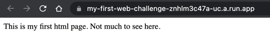


## Reminder about session and instances

Cloud Run will route incoming requests to your application and spin up new instances as needed if the load becomes heavy.

A naive approach at keeping session state in a global variable will fail since the instances are ephemeral and any given user might get routed to instance 1 and later to instance 7 where the global variable value in instance 1 is not to be found.

You might think you could set min = max = 1 and THEN use global variables to manage some kind of session state.

This would also be dangerous since Cloud Run is free to spin down your instance and spin up a new one in its place any time it likes.

If your challenge does need session state, a good first try is to manage it in client-side cookies using something like JWT (JSON Web Token).

The details are beyond the scope of this article.

If you need "real" session storage, it is possible to get a Cloud Run application to talk to a REDIS instance.

Here is at least [one article](https://medium.com/google-cloud/using-memorystore-with-cloud-run-82e3d61df016) that might help you.


