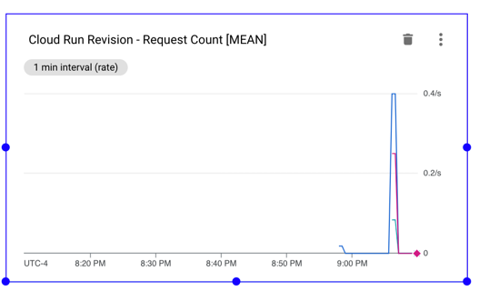

# How to Host CTF Web Challenges

These are things I've learned about hosting CTF web challenges using Google Cloud Run on Google Cloud Platform (GCP).

## UIs Change Over Time

**Note added (years) later**: Some of the screenshots below differ slightly from the current web UI, but the general concepts remain the same.

## Requirements/Limitations
- The challenge must be a web application.
- This technique does not support arbitrary protocols/ports.
- Your web application can listen on any ports internally but only one internal port can be exposed to the Internet on port 443 via `https://`.
- The challenge must be containerized as a Docker image.
- You must have a google cloud account.
- You must install the gcloud command line tooling.
- It is easiest if your web application requires no server-side session/state.
  - With some effort, you can set up a Cloud Run service to talk to a Google-hosted REDIS instance but it is well worth some effort to see if you can avoid the need for this.
  - For example, you might be able to keep the entire session state in a Cookie using something like JWT.
- These steps were done on a Mac.  YMMV

## What Should I Do First?

- If your CTF event planning is far enough along, you should seek [sponsorship from GCP](https://services.google.com/fb/forms/ctfsponsorship/).
  - If you get sponsored, you'll get some free google cloud money to help host your event.
- Learn Docker.  There are lots of great resources online.  Install Docker locally and run through some online tutorials.
  - Here is at least one way [to get started](https://www.youtube.com/watch?v=3c-iBn73dDE).
- Sign up for [Google Cloud Platform (GCP)](https://console.cloud.google.com/). When I first did this with my personal Google account, it gave me $300 free cloud bucks and a few months to spend them.
  - This is a wonderful way to play around with the bits of GCP that are interesting to you.
  - Note: There are likely too many facets to try to learn everything in a few months.
  - You'll encounter a few of them in these instructions and the rest will just be purposefully ignored.
- [Setup a Google Cloud "Project"](https://cloud.google.com/resource-manager/docs/creating-managing-projects).
  - Inside such a "project" is where you will do everything related to your CTF challenge hosting.
  - You can create multiple projects if you like, but the things you do inside one will not affect or be seen by the other. 
- [Install the gcloud CLI (command line interface)](https://cloud.google.com/sdk/docs/install) onto your computer.
  - As you progress in the instructions, you'll see that you can often set up something in GCP just by using the Web UI.  However, it is well worth getting used to the gcloud CLI since it allows for easier automation such as with bash scripts. 
  - At some point you'll run `gloud init`.  This is where you will:
    - authenticate gcloud so that it has permissions to "talk to" your GCP project
    - select which "project" you want gcloud to talk to by default (it is easy to switch between projects and even between multiple google accounts if needed)

For this tutorial, I created this project:


## My First Web Challenge

Here, we'll create a trivial web challenge and deploy it to Google Cloud Run.

### Challenge Application Source Files

See the `my-first-web-challenge` folder in this repository for the files cited here.

You'll want [nodejs installed](https://nodejs.org/en/download/) if you want to follow along with all the steps here.

Here are the files that make up the source of the challenge app.

[package.json]
```
{
  "name": "my-first-web-challenge",
  "version": "1.0.0",
  "description": "",
  "main": "index.js",
  "scripts": {
    "test": "echo \"Error: no test specified\" && exit 1"
  },
  "author": "",
  "license": "ISC",
  "dependencies": {
    "express": "^4.17.3"
  }
}
```

[package-lock.json]
This file is created automatically when you first run `npm install` (see below).  You generally want this file to be under source control.


[index.js]
```
let express = require('express');
let app = express();

app.get('/', function(req, res) {
    res.sendFile(__dirname + '/index.html')
});

let port = 8000;
let server = app.listen(port);
console.log('Local server running on port: ' + port);
```

[index.html]
```
<html>
<body>
<p>This is my first html page.  Not much to see here.</p>
<!-- flag{wh4t_m4d3_y0u_l00k_h3r3?} -->
</body>
</html>
```

I won't be teaching you how to use node or the express library but there are 
lots of great resources online.

### Run the Challenge Locally (without Docker)

First bring up a terminal window and cd into the `my-first-web-challenge` folder.

Run this command:

`npm install`

`npm` is part of nodejs.  This will study package.json (actually package-lock.json) and download the express library and its dependencies into a folder named `node_modules` (which will be created).

You might see output like this:

```
added 50 packages, and audited 51 packages in 546ms

2 packages are looking for funding
  run `npm fund` for details

found 0 vulnerabilities
```

And now you'll notice a `node_modules` folder has been created.

**Note**: You should always add `node_modules` to a `.gitignore` file in your git repository.  This will prevent the contents of this folder from being added to source control.

We can now run the application:

`node index.js`

You should see:
`Local server running on port: 8000`

**Note**: This assumes this port is free on your computer.  Feel free to edit `index.js` to use another port.

Now if you open your web browser to this link:

[http://localhost:8000/](http://localhost:8000/)

and you should see something like:


Of course, if you right-click inside the page and select View Page Source you'll see the flag:


You can press `Control+C` in the terminal window to stop the application.

### Run the Challenge Using Docker

In order to containerize our challenge application, we'll need a `Dockerfile`.

[Dockerfile]
```
FROM node:19

RUN mkdir -p /ctf/app
WORKDIR /ctf/app

COPY ./package.json ./
COPY ./package-lock.json ./
RUN npm install

COPY ./index.js ./
COPY ./index.html ./
EXPOSE 8000

CMD ["node", "index.js"]
```

[.dockerignore] (not really needed in this project but might be useful in a more complex project)
```
# files to not include in the image
Dockerfile
docker-compose.yml
node_modules
```

It is not our intention to teach you Docker but a couple items here are worth pointing out.

Note that the `EXPOSE 8000` line is purely decorative.  Docker completely ignores it.  It is mainly there to help the reader know that the application will be listening on a certain port.

Also, notice this copies the `package.json` and `package-lock.json` files and then runs `npm install`.

Then afterward, it copies `index.js` and `index.html`.

Why not just copy **everything** up front and then run `npm install`?

Because Docker keeps track of the state of your image after every line of the Dockerfile.

If you are rebuilding an image and Docker can convince itself that all the inputs up to a certain line have not changed, then it'll skip those steps and just use its cached status.

So, if you copied everything up front, then any edit you make to `index.js` or `index.html` will cause `npm install` to re-run when you build the image.

In contrast, in the above `Dockerfile`, edits to these files will not cause `npm install` to run because none of the files cited before that line will have changed.


We can now build our docker image:

```docker build -t my-first-web-challenge:1.0 .```

This tells docker to build an image with the name `my-first-web-challenge` and the tag `1.0`.
The `.` at the end tells it to study the `Dockerfile` in the current directory.

You might get output like this:

```
[+] Building 11.8s (13/13) FINISHED
 => [internal] load build definition from Dockerfile                                                                                                                                             0.0s
 => => transferring dockerfile: 243B                                                                                                                                                             0.0s
 => [internal] load .dockerignore                                                                                                                                                                0.0s
 => => transferring context: 119B                                                                                                                                                                0.0s
 => [internal] load metadata for docker.io/library/node:19                                                                                                                                       1.4s
 => [1/8] FROM docker.io/library/node:19@sha256:2405a991a6d9f6ac1d991feefc0a4539d5187abd2ca532fd18f7185c98b32a45                                                                                 7.8s
 => => resolve docker.io/library/node:19@sha256:2405a991a6d9f6ac1d991feefc0a4539d5187abd2ca532fd18f7185c98b32a45                                                                                 0.0s
 => => sha256:6fefd22bacd949d1b8d83d84b45262807b5866a39391812d5a4cf8faa06e5dff 46.21MB / 46.21MB                                                                                                 4.9s
 => => sha256:b29db415cb2e17747a71b0e0a933e80ede0c6cb9a9b14bb778b62274ad051324 2.28MB / 2.28MB                                                                                                   1.1s
 => => sha256:ac779c6d4c57ce066a8b14043f5f0e3c9542b10a26340d2b29af95dd3815a06f 7.56kB / 7.56kB                                                                                                   0.0s
 => => sha256:2405a991a6d9f6ac1d991feefc0a4539d5187abd2ca532fd18f7185c98b32a45 1.21kB / 1.21kB                                                                                                   0.0s
 => => sha256:3521b8b34fe48d6557b934b6a9c42d0a92b87ee32de0aac13f37ebbfc77c1ca2 2.21kB / 2.21kB                                                                                                   0.0s
 => => sha256:4f4cf292bc62eeea8a34b4160f3ef1f335b6b7b2bb9d28c605dc4002c8a24bc2 4.21kB / 4.21kB                                                                                                   0.1s
 => => extracting sha256:4f4cf292bc62eeea8a34b4160f3ef1f335b6b7b2bb9d28c605dc4002c8a24bc2                                                                                                        0.0s
 => => sha256:adc76471ff8a23a6b5a33c3e2bf508d54d85901b34e02c7df9a8430bf65b0ce5 455B / 455B                                                                                                       0.4s
 => => extracting sha256:6fefd22bacd949d1b8d83d84b45262807b5866a39391812d5a4cf8faa06e5dff                                                                                                        2.4s
 => => extracting sha256:b29db415cb2e17747a71b0e0a933e80ede0c6cb9a9b14bb778b62274ad051324                                                                                                        0.1s
 => => extracting sha256:adc76471ff8a23a6b5a33c3e2bf508d54d85901b34e02c7df9a8430bf65b0ce5                                                                                                        0.0s
 => [internal] load build context                                                                                                                                                                0.0s
 => => transferring context: 39.70kB                                                                                                                                                             0.0s
 => [2/8] RUN mkdir -p /ctf/app                                                                                                                                                                  0.4s
 => [3/8] WORKDIR /ctf/app                                                                                                                                                                       0.0s
 => [4/8] COPY ./package.json ./                                                                                                                                                                 0.0s
 => [5/8] COPY ./package-lock.json ./                                                                                                                                                            0.0s
 => [6/8] RUN npm install                                                                                                                                                                        1.8s
 => [7/8] COPY ./index.js ./                                                                                                                                                                     0.0s
 => [8/8] COPY ./index.html ./                                                                                                                                                                   0.0s
 => exporting to image                                                                                                                                                                           0.1s
 => => exporting layers                                                                                                                                                                          0.1s
 => => writing image sha256:c7394a83723321b4b1f9524330a059a0fd8f3b43e3de231823c62649310cbdfb                                                                                                     0.0s
 => => naming to docker.io/library/my-first-web-challenge:1.0
```

We can now ask docker to list all the images and this one should now be included in the list output.

`docker images`

Possible output:

```
REPOSITORY               TAG       IMAGE ID       CREATED         SIZE
my-first-web-challenge   1.0       4cc2c043a381   3 minutes ago   920MB
```

Now that we have created an image, we can run it.  This will create a container from the image.

`docker run --rm -p 7000:8000 --name fun-app my-first-web-challenge:1.0`

- `--rm` tells Docker to remove the container that was created after it stops
  - this is not really needed but helps reduce clutter by reducing the count of Docker containers lying around
- `-p 7000:8000` causes Docker to listen for traffic on port 7000 and map it to port 8000 inside the container
  - this mainly drives home the point that you have to specify both an external and internal port or else no traffic will reach your application
- `--name fun-app` names the newly-created container `fun-app`
  - if you don't specify a name, docker will make up one for you
- `my-first-web-challenge:1.0` the image name and tag used to create the container

Again you should see output like:

```
Local server running on port: 8000
```

You can now access the application using this link:

[http://localhost:7000/](http://localhost:7000/)

and it should show just as before.

In another terminal window run:

`docker ps`

You should see output like this:

```
CONTAINER ID   IMAGE                        COMMAND                  CREATED         STATUS         PORTS                    NAMES
c879bb129966   my-first-web-challenge:1.0   "docker-entrypoint.s…"   7 minutes ago   Up 7 minutes   0.0.0.0:7000->8000/tcp   fun-app
```

To stop the application, you can use the Docker Dashboard UI or run this command:

`docker stop fun-app`

**Note**: You might be able to stop the application by pressing `Control+C` in the terminal window you used to start it. However, I'm not certain this is guaranteed to always work.


## Deploy the Image to Google Artifact Registry

We now want to upload our Docker image into Google Artifact Registry.

**Note**: You could also use Container Registry but Google seems to be downplaying that in favor of Artifact Registry.

### Artifact Registry Web UI

The menu on the left of the GCP web UI has lots of items.  Just keep scrolling down until you find it here:


I recommend pinning that item so it'll appear for you at the top of the menu.

When you click it, you'll likely see a page like this telling you that you have to enable the associated API:


Go ahead and enable it and you'll see a page like this with no items in the table yet.


Now click **CREATE REPOSITORY**

And fill it out something like this:


Then click CREATE at the bottom and you should see something like this:


If you click on the **locker** link you'll see an empty repository:


### Allow docker to "push" to Artifact Registry repository

In order to get our web docker image into Google Artifact Registry we need to setup docker to be allowed to "push" to it.

[These instructions](https://cloud.google.com/artifact-registry/docs/docker/authentication#gcloud-helper) will help you.

First run this: `gcloud auth login`

This will open the browser and allow you to select the google account you want to use.  It'll then ask you to confirm the permissions that gcloud needs.

Next run a command like this: `gcloud auth configure-docker <your-region>-docker.pkg.dev`

where `<your-region>` is replaced by whatever region you picked earlier.

In this case it would be: `gcloud auth configure-docker us-east5-docker.pkg.dev` 

This will setup docker to be able to push to your project's container registry.  You might see output like:

```
Adding credentials for: us-east5-docker.pkg.dev
After update, the following will be written to your Docker config file located at [/Users/sambrow/.docker/config.json]:
 {
  "credHelpers": {
    "us-east5-docker.pkg.dev": "gcloud"
  }
}

Do you want to continue (Y/n)?  Y

Docker configuration file updated.
```

You'll notice the above content in your `~/.docker/config.json` file.


### Tag and Push the Image

Run this command to "tag" the image as being associated with your GCP project.

`docker tag my-first-web-challenge:1.0 us-east5-docker.pkg.dev/my-first-project-381423/locker/my-first-web-challenge:1.0`

The syntax here is:

`docker tag <local-image-name>:<local-image-tag> <your-region>-docker.pkg.dev/<your-gcp-project-identifier>/<local-image-name>:<local-image-tag>`

This should run immediately and produce no output.

To verify it actually did something run: `docker images`

and you should see an new entry.

Now we can ask docker to "push" this image to Google Artifact Registry:

`docker push us-east5-docker.pkg.dev/my-first-project-381423/locker/my-first-web-challenge:1.0`

You might see output like this:

````
The push refers to repository [us-east5-docker.pkg.dev/my-first-project-381423/locker/my-first-web-challenge]
deafc041a779: Pushed
c561844c2548: Pushed
f22997732bf8: Pushed
21c4b65059ee: Pushed
3059e6198f70: Pushed
5f70bf18a086: Layer already exists
1cdf5968ef7a: Pushed
3dead16a7183: Pushed
be05630b36e9: Pushed
2d6abd2a74fb: Pushed
e64d92eb4ecd: Pushed
ac504d030134: Pushed
52ebb9a789db: Pushed
86d774dafc20: Pushed
da68f13652fc: Pushed
cf2e8433dbf2: Pushed
1.0: digest: sha256:fb3153d147042dea6e65d3afb4bb2c0f386a1c2837f7616b2103a38dff0789f7 size: 3668
````

### Viewing the Image in Artifact Registry

If you refresh your Artifact Registry web page, you should now see your pushed image:


If you click on the image name, you are brought to a detail page like this:


**Note**: You can build newer images with the same tag (or updated tags like `1.1` or `2.0`) and run through the above steps with them as well.  They'll appear as new rows inside the details page for that image.

## Creating your first Google Cloud Run Service

Now that we have an image uploaded to Artifact Registry, we can create our first real web application inside Cloud Run.

First we'll do it via the web ui and later learn how to do it using the gcloud CLI.

Find the Cloud Run menu item in the large menu on the left.  Again, I suggest pinning it so it stays at the top.


Open the Cloud Run web ui and you'll see you have no Services defined yet:


Start defining a service by clicking the **CREATE SERVICE** link.

The first item we specify is the image/revision we want to use.  Click the SELECT link here:


A list of your items from the Artifact Registry will appear on the right. Select the one you want:


For the next several choices, we'll accept the defaults.

However, we have to decide whether to allow unauthenticated access.  For a CTF, that is exactly what we want:


Some minor notes on these items:

- CPU allocation and pricing:
  - We left this at the default "CPU is only allocated during request processing".
  - In our experience, this worked fine and it is cheaper as well.
- Autoscaling:
  - min = 0, max = 100
  - When nobody is accessing your challenge Google will spin down all your instances to save money/resources.
  - If your challenge starts getting traffic, it will spin some back up.
  - If it gets a LOT of traffic, it will spin up even more instances.  It has a default heuristic that is fine but you can teak it as you'll see later.
  - I recommend, setting min to be >= 1 so that there is always at least one "alive" to avoid spin up delays.
  - If you have a web challenge where the timing of the request/response is important, you might consider setting min and max to the same value.  This will cost more (but likely not much) but will avoid the latency of spinning up a new instance.
- Authentication
  - Allow unauthenticated invocations
  - That's exactly what we want for a CTF challenge.


At the bottom is a **Container, Networking, Security** section.  Expand this.

The default connection port is `8080` and you'll want to change it to be `8000` for this example.


You can leave the next couple fields blank.

Next you enter the **Capacity** details:


For a low-resource web challenges, you can likely go with the defaults.
I did increase the memory and CPUs in a challenge that used Puppeteer to invoke a headless version of Chrome.

I suggest you test out your challenge under some reasonable load to ensure you won't be surprised when your CTF opens.  Such testing is outside the scope of this document.

Here is where you can tweak the **Max requests per container**.

If more than this many simulaneous requests come in, then Cloud Run will spin up new instances as needed to keep the load per instance less than this.

Again, I've only reduced this in the case where the challenge invoked a headless Chrome.

Finally, select your desired **Execution environment**


I think most web challenges will do fine with the "First generation".

I suggest only switching to the "Second generation" if you notice some issue.


## Hold Up!

Before you click **CREATE** to create your first Cloud Run Service, take a moment and notice the **SHOW COMMAND LINE** link at the upper right of the web page.

Go ahead and click that and you'll see:


Save that command line away for later reference:

```
gcloud run deploy my-first-web-challenge \
--image=us-east5-docker.pkg.dev/my-first-project-381423/locker/my-first-web-challenge@sha256:fb3153d147042dea6e65d3afb4bb2c0f386a1c2837f7616b2103a38dff0789f7 \
--allow-unauthenticated \
--port=8000 \
--service-account=395449254548-compute@developer.gserviceaccount.com \
--region=us-east5 \
--project=my-first-project-381423
```

Notice that since we mostly took the defaults, there are not that many options.  If we had varied from the defaults, this command line would then specify more things.

## Back to the show

Ok, now dismiss the pane on the right and click the **CREATE** button.

This will display some in-progress status as it does the work:


Internally, it will create an instance of your challenge and verify that it is actually listening on the port (8000) that you specified.

If there is any issue, you'll see an explanatory error.

After it finishes, you'll see something like this:


Notice at the top there is a **URL** for your app like: 

https://my-first-web-challenge-to3hkfmw4q-ul.a.run.app

You can see this link uses `https://`.  There is no support for `http://`.

Also notice the domain name starts with the name of your service.

The remainder of the domain name is some unique characters followed by the rest of the domain.

This URL will remain stable as long as you keep the same docker image name.  The unique part is specific to your current project.

If you create another Cloud Run service with a different service name, you'll get a similar-looking URL that starts with that service's name and the rest will be identical to your first URL.

Let's click the link and see our app!


## Notes about sessions and instances

Cloud Run will route incoming requests to your application and spin up new instances as needed if the load becomes heavy.

A naive approach at keeping session state in a global variable will fail since the instances are ephemeral and any given user might get routed to instance 1 and later to instance 7 where the global variable value in instance 1 is not to be found.

You might think you could set min = max = 1 and THEN use global variables to manage some kind of session state.

This would likely work ok in practice but could be dangerous since Cloud Run is free to spin down your instance and spin up a new one in its place any time it likes.

If your challenge does need session state, a good first try is to manage it in client-side cookies using something like JWT (JSON Web Token).

The details are beyond the scope of this article.

In the **Container, Networking, Security** section, under **Networking**, there is an option for **Session affinity**. This will assign a cookie to the browser on its first visit to your challenge and the load balancer will try to route to the same instance every time.  For various reasons, it might not be able to but this should work ok in practice.

If you need "real" session storage shared across all instances, it is possible to get a Cloud Run application to talk to a REDIS instance.

Here is at least [one article](https://medium.com/google-cloud/using-memorystore-with-cloud-run-82e3d61df016) that might help you.


## Taking Down the Web Challenge

To stop the web challenge, you need to select it in the Services web page and then click the DELETE icon at the top.

As far as I know, there is no "pause service" feature.

To start it again, you can repeat the earlier steps to create the service over again.  If you use the same image from the Container Registry, your challenge URL will be unchanged.

**Note:** This is where it is very useful to use the gcloud CLI.  Once you delete a Service, you can easily re-create it by just running the same gcloud command you used earlier.


## gcloud CLI

In an earlier step, you saved off the command line to create a service.  If you delete the Service and want to re-create it, it is likely easier to use the saved command:

```
gcloud run deploy my-first-web-challenge \
--image=us-east5-docker.pkg.dev/my-first-project-381423/locker/my-first-web-challenge@sha256:fb3153d147042dea6e65d3afb4bb2c0f386a1c2837f7616b2103a38dff0789f7 \
--allow-unauthenticated \
--port=8000 \
--service-account=395449254548-compute@developer.gserviceaccount.com \
--region=us-east5 \
--project=my-first-project-381423
```


To see a list of your Services:

`gcloud run services list`

possible output:

```
   SERVICE                 REGION       URL                                                     LAST DEPLOYED BY    LAST DEPLOYED AT
✔  my-first-web-challenge  us-east5     https://my-first-web-challenge-to3hkfmw4q-ul.a.run.app  ????????@gmail.com  2023-03-27T23:50:44.869891Z
```


To delete a running Service:

`gcloud run services delete my-first-web-challenge --region=us-east5 --project=my-first-project-381423`

This will ask for confirmation.

If you want it to just do it without confirming, you can add the `-q` option.

`gcloud run services delete my-first-web-challenge -q --region=us-east5 --project=my-first-project-381423`


If you are working with a group of web challenges, it is likely best to setup shell scripts:

- one to start them all
- one to stop them all


## Solvers

I strongly recommend creating solvers for your web challenges.  I usually do this in python using the requests package to make http requests.

You can then create another shell script that runs all your solvers to prove your challenges are all in a good state.

## Logs

If your web challenges writes to stdout, GCP will let you view such output in the web UI.

On the Services page, you can see your list of running challenges.

Clicking one of these will bring you to the METRICS page for that challenge.

You can then click the LOGS tab to access these logs.

You can use the Filter feature to filter down to just lines containing specified text.

## Dashboards

In the GCP menu on the left, select Monitoring and then Dashboards:


Note: Before proceeding, be sure to generate "some" traffic to your challenge.  A few page loads should be enough.  By default the web UI only offers you metrics that have data.  By visiting the page, you'll generate some data for the metric we want.

Click CREATE DASHBOARD:


Give your dashboard a name and then click the Line entry from the Chart Library:


Open up the **Resource & Metric** dropdown and select Cloud Run Revision:


From the ACTIVE METRIC CATEGORIES, select **Request_count** and then from ACTIVE METRICS select **Request Count**:


Then click APPLY.

You should now see this widget appear in your dashboard:



Using this web UI, you can change the interval of time shown in your widget.

If you have multiple web challenges, traffic for all of them will appear in this one widget where each challenge is a different color.

There are MANY other metrics you might be interested in. Feel free to explore.


# Private Challenge Instances

## Overview

In all of the above, the idea is that every contestant will be hitting the same challenge instance. Google Cloud Run might spin up multiple instances based on load but it is still true that multiple contestants will be hitting the same instance.

Because of this, web challenges should be designed very carefully so that one contestant cannot spoil the challenge for everyone else. 

For example, if your challenge allows RCE (remote code execution) and your challenge is not setup carefully, a contestant could alter/delete the flag file for example. This would cause all kinds of confusion during the CTF event.

In the past, I've seen a few CTFs that allow you to "spin up" a private challenge instance.  These generally have a limited lifetime but can be renewed by the contestant. The obvious advantage is that the contestant cannot spoil the challenge for anyone else since they have their own private instance that, in theory, nobody else is talking to.

Many of these private challenges that I've seen differ only by the port. It would be fairly easy for a malicious contestant to scan the ports to find instances in used by other teams and potentially spoil them or maybe even leverage them to get the flag without actually solving the challeng themselves.

**Note**: It is best to avoid private challenge instances if possible since they complicate the hosting. If you have some string reason for private instances, then please read on to see how I did it.

## Design Goals

I've always wanted figure out how to host private web challenges so in 2024 I gave it a shot.

My design goals were:

- allow per-team (not per-contestant) private challenge instances
- make it impossible/infeasible for one team to interact with another team's private instance
- use the Google Cloud Run infrastruture that I was already familiar with
- leverage CTFd's ability to write a "custom" challenge type in order to expose private challenges in the CTFd web UI


**TODO: Continue here**

Including some screenshots here that I'll later suround with explanatory text.


